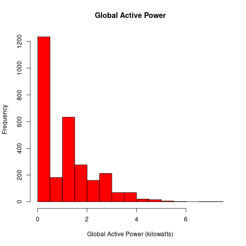
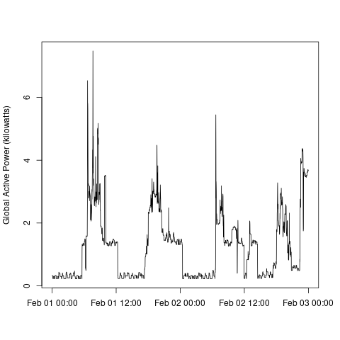
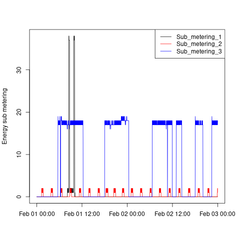
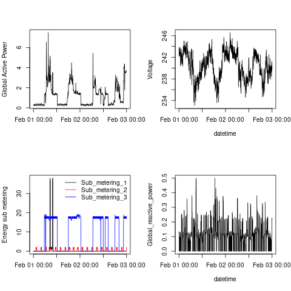

# Introduction

This assignment uses data from
the <a href="http://archive.ics.uci.edu/ml/">UC Irvine Machine
Learning Repository</a>, a popular repository for machine learning
datasets. In particular, we will be using the "Individual household
electric power consumption Data Set" which I have made available on
the course web site:

* <b>Dataset</b>: <a href="https://d396qusza40orc.cloudfront.net/exdata%2Fdata%2Fhousehold_power_consumption.zip">Electric power consumption</a> [20Mb]

* <b>Description</b>: Measurements of electric power consumption in
one household with a one-minute sampling rate over a period of almost
4 years. Different electrical quantities and some sub-metering values
are available.

The following descriptions of the 9 variables in the dataset are taken
from
the <a href="https://archive.ics.uci.edu/ml/datasets/Individual+household+electric+power+consumption">UCI
web site</a>:

<ol>
<li><b>Date</b>: Date in format dd/mm/yyyy </li>
<li><b>Time</b>: time in format hh:mm:ss </li>
<li><b>Global_active_power</b>: household global minute-averaged active power (in kilowatt) </li>
<li><b>Global_reactive_power</b>: household global minute-averaged reactive power (in kilowatt) </li>
<li><b>Voltage</b>: minute-averaged voltage (in volt) </li>
<li><b>Global_intensity</b>: household global minute-averaged current intensity (in ampere) </li>
<li><b>Sub_metering_1</b>: energy sub-metering No. 1 (in watt-hour of active energy). It corresponds to the kitchen, containing mainly a dishwasher, an oven and a microwave (hot plates are not electric but gas powered). </li>
<li><b>Sub_metering_2</b>: energy sub-metering No. 2 (in watt-hour of active energy). It corresponds to the laundry room, containing a washing-machine, a tumble-drier, a refrigerator and a light. </li>
<li><b>Sub_metering_3</b>: energy sub-metering No. 3 (in watt-hour of active energy). It corresponds to an electric water-heater and an air-conditioner.</li>
</ol>

## Loading the data

install.packages(c("data.table"))
library(data.table)

### Data Loading ####
# Read data, subsetting for 2007-02-01 and 2007-02-02
data <- fread("household_power_consumption.txt", sep = ";", na.strings = "?", 
              select = c("Date", "Time", "Global_active_power", "Global_reactive_power", 
                         "Voltage", "Global_intensity", "Sub_metering_1", 
                         "Sub_metering_2", "Sub_metering_3"))[Date %in% c("1/2/2007", "2/2/2007")]

# Combine Date and Time into a single POSIXct column
data$Datetime <- as.POSIXct(strptime(paste(data$Date, data$Time), "%d/%m/%Y %H:%M:%S"))

# Convert columns to numeric if needed
data$Global_active_power <- as.numeric(data$Global_active_power)
data$Sub_metering_1 <- as.numeric(data$Sub_metering_1)
data$Sub_metering_2 <- as.numeric(data$Sub_metering_2)
data$Sub_metering_3 <- as.numeric(data$Sub_metering_3)
data$Voltage <- as.numeric(data$Voltage)
data$Global_reactive_power <- as.numeric(data$Global_reactive_power)

When loading the dataset into R, please consider the following:

* The dataset has 2,075,259 rows and 9 columns. First
calculate a rough estimate of how much memory the dataset will require
in memory before reading into R. Make sure your computer has enough
memory (most modern computers should be fine).

* We will only be using data from the dates 2007-02-01 and
2007-02-02. One alternative is to read the data from just those dates
rather than reading in the entire dataset and subsetting to those
dates.

* You may find it useful to convert the Date and Time variables to
Date/Time classes in R using the `strptime()` and `as.Date()`
functions.

* Note that in this dataset missing values are coded as `?`.

## Making Plots

Our overall goal here is simply to examine how household energy usage
varies over a 2-day period in February, 2007. Your task is to
reconstruct the following plots below, all of which were constructed
using the base plotting system.

First you will need to fork and clone the following GitHub repository:
[https://github.com/rdpeng/ExData_Plotting1](https://github.com/rdpeng/ExData_Plotting1)

For each plot you should

* Construct the plot and save it to a PNG file with a width of 480
pixels and a height of 480 pixels.

* Name each of the plot files as `plot1.png`, `plot2.png`, etc.

* Create a separate R code file (`plot1.R`, `plot2.R`, etc.) that
constructs the corresponding plot, i.e. code in `plot1.R` constructs
the `plot1.png` plot. Your code file **should include code for reading
the data** so that the plot can be fully reproduced. You should also
include the code that creates the PNG file.

* Add the PNG file and R code file to your git repository

When you are finished with the assignment, push your git repository to
GitHub so that the GitHub version of your repository is up to
date. There should be four PNG files and four R code files.

The four plots that you will need to construct are shown below. 

## Results

### Plot 1
install.packages(c("data.table"))
library(data.table)

### Data Loading ####
# Read data, subsetting for 2007-02-01 and 2007-02-02
data <- fread("household_power_consumption.txt", sep = ";", na.strings = "?", 
              select = c("Date", "Time", "Global_active_power", "Global_reactive_power", 
                         "Voltage", "Global_intensity", "Sub_metering_1", 
                         "Sub_metering_2", "Sub_metering_3"))[Date %in% c("1/2/2007", "2/2/2007")]

# Combine Date and Time into a single POSIXct column
data$Datetime <- as.POSIXct(strptime(paste(data$Date, data$Time), "%d/%m/%Y %H:%M:%S"))

# Convert columns to numeric if needed
data$Global_active_power <- as.numeric(data$Global_active_power)
data$Sub_metering_1 <- as.numeric(data$Sub_metering_1)
data$Sub_metering_2 <- as.numeric(data$Sub_metering_2)
data$Sub_metering_3 <- as.numeric(data$Sub_metering_3)
data$Voltage <- as.numeric(data$Voltage)
data$Global_reactive_power <- as.numeric(data$Global_reactive_power)

#### plot1.R ####
# Load data
data <- read.csv("household_power_consumption.txt", sep = ";", na.strings = "?", 
                 stringsAsFactors = FALSE)
data <- data[data$Date %in% c("1/2/2007", "2/2/2007"), ]

# Convert Global_active_power to numeric
data$Global_active_power <- as.numeric(data$Global_active_power)

# Create PNG plot
png("plot1.png", width = 480, height = 480)
hist(data$Global_active_power, col = "red", 
     main = "Global Active Power", 
     xlab = "Global Active Power (kilowatts)", 
     ylab = "Frequency")
dev.off()

### Plot 2
install.packages(c("data.table"))
library(data.table)

### Data Loading ####
# Read data, subsetting for 2007-02-01 and 2007-02-02
data <- fread("household_power_consumption.txt", sep = ";", na.strings = "?", 
              select = c("Date", "Time", "Global_active_power", "Global_reactive_power", 
                         "Voltage", "Global_intensity", "Sub_metering_1", 
                         "Sub_metering_2", "Sub_metering_3"))[Date %in% c("1/2/2007", "2/2/2007")]

# Combine Date and Time into a single POSIXct column
data$Datetime <- as.POSIXct(strptime(paste(data$Date, data$Time), "%d/%m/%Y %H:%M:%S"))

# Convert columns to numeric if needed
data$Global_active_power <- as.numeric(data$Global_active_power)
data$Sub_metering_1 <- as.numeric(data$Sub_metering_1)
data$Sub_metering_2 <- as.numeric(data$Sub_metering_2)
data$Sub_metering_3 <- as.numeric(data$Sub_metering_3)
data$Voltage <- as.numeric(data$Voltage)
data$Global_reactive_power <- as.numeric(data$Global_reactive_power)

### plot2.R ####
# Load data
data <- read.csv("household_power_consumption.txt", sep = ";", na.strings = "?", 
                 stringsAsFactors = FALSE)
data <- data[data$Date %in% c("1/2/2007", "2/2/2007"), ]

# Create Datetime column
data$Datetime <- as.POSIXct(strptime(paste(data$Date, data$Time), "%d/%m/%Y %H:%M:%S"))

# Convert Global_active_power to numeric
data$Global_active_power <- as.numeric(data$Global_active_power)

# Create PNG plot
png("plot2.png", width = 480, height = 480)
plot(data$Datetime, data$Global_active_power, type = "l", 
     xlab = "", ylab = "Global Active Power (kilowatts)")
dev.off()

### Plot 3
install.packages(c("data.table"))
library(data.table)

### Data Loading ####
# Read data, subsetting for 2007-02-01 and 2007-02-02
data <- fread("household_power_consumption.txt", sep = ";", na.strings = "?", 
              select = c("Date", "Time", "Global_active_power", "Global_reactive_power", 
                         "Voltage", "Global_intensity", "Sub_metering_1", 
                         "Sub_metering_2", "Sub_metering_3"))[Date %in% c("1/2/2007", "2/2/2007")]

# Combine Date and Time into a single POSIXct column
data$Datetime <- as.POSIXct(strptime(paste(data$Date, data$Time), "%d/%m/%Y %H:%M:%S"))

# Convert columns to numeric if needed
data$Global_active_power <- as.numeric(data$Global_active_power)
data$Sub_metering_1 <- as.numeric(data$Sub_metering_1)
data$Sub_metering_2 <- as.numeric(data$Sub_metering_2)
data$Sub_metering_3 <- as.numeric(data$Sub_metering_3)
data$Voltage <- as.numeric(data$Voltage)
data$Global_reactive_power <- as.numeric(data$Global_reactive_power)

### plot3.R ####
# Load data
data <- read.csv("household_power_consumption.txt", sep = ";", na.strings = "?", 
                 stringsAsFactors = FALSE)
data <- data[data$Date %in% c("1/2/2007", "2/2/2007"), ]

# Create Datetime column
data$Datetime <- as.POSIXct(strptime(paste(data$Date, data$Time), "%d/%m/%Y %H:%M:%S"))

# Convert sub-metering to numeric
data$Sub_metering_1 <- as.numeric(data$Sub_metering_1)
data$Sub_metering_2 <- as.numeric(data$Sub_metering_2)
data$Sub_metering_3 <- as.numeric(data$Sub_metering_3)

# Create PNG plot
png("plot3.png", width = 480, height = 480)
plot(data$Datetime, data$Sub_metering_1, type = "l", col = "black", 
     xlab = "", ylab = "Energy sub metering")
lines(data$Datetime, data$Sub_metering_2, col = "red")
lines(data$Datetime, data$Sub_metering_3, col = "blue")
legend("topright", lty = 1, col = c("black", "red", "blue"), 
       legend = c("Sub_metering_1", "Sub_metering_2", "Sub_metering_3"))
dev.off()

### Plot 4

data <- read.csv("household_power_consumption.txt", sep = ";", na.strings = "?", 
                 stringsAsFactors = FALSE)
data <- data[data$Date %in% c("1/2/2007", "2/2/2007"), ]

# Crear columna Datetime
data$Datetime <- as.POSIXct(strptime(paste(data$Date, data$Time), "%d/%m/%Y %H:%M:%S"))

# Convertir variables a numéricas
data$Global_active_power <- as.numeric(data$Global_active_power)
data$Global_reactive_power <- as.numeric(data$Global_reactive_power)
data$Voltage <- as.numeric(data$Voltage)
data$Sub_metering_1 <- as.numeric(data$Sub_metering_1)
data$Sub_metering_2 <- as.numeric(data$Sub_metering_2)
data$Sub_metering_3 <- as.numeric(data$Sub_metering_3)

# Crear PNG con 4 gráficos
png("plot4.png", width = 480, height = 480)

# Cuadrícula 2x2
par(mfrow = c(2, 2))

# Gráfico 1: Global Active Power
plot(data$Datetime, data$Global_active_power, type = "l", 
     xlab = "", ylab = "Global Active Power")

# Gráfico 2: Voltage
plot(data$Datetime, data$Voltage, type = "l", 
     xlab = "datetime", ylab = "Voltage")

# Gráfico 3: Sub-metering
plot(data$Datetime, data$Sub_metering_1, type = "l", col = "black",
     xlab = "", ylab = "Energy sub metering")
lines(data$Datetime, data$Sub_metering_2, col = "red")
lines(data$Datetime, data$Sub_metering_3, col = "blue")
legend("topright", bty = "n", lty = 1, col = c("black", "red", "blue"),
       legend = c("Sub_metering_1", "Sub_metering_2", "Sub_metering_3"))

# Gráfico 4: Global Reactive Power
plot(data$Datetime, data$Global_reactive_power, type = "l", 
     xlab = "datetime", ylab = "Global_reactive_power")

# Cerrar PNG
dev.off()
